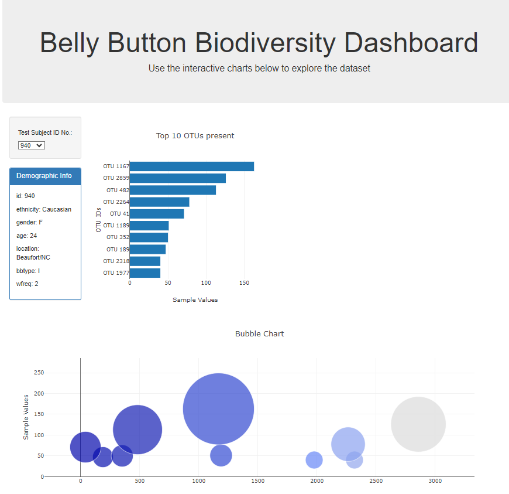

Belly Button Challeng

Goal
The goal of the project was to develop a dashboard that provides an interactive experience for anyone who is interacting with the dataset. 

Project Description
In this project, we built an interactive dashboard to explore the Belly Button Biodiversity datasetLinks to an external site., which catalogues the microbes that colonise human navels. The dataset reveals that a small handful of microbial species (also called operational taxonomic units, or OTUs, in the study) were present in more than 70% of people, while the rest were relatively rare.

The application allows users to select a particular ID and have the relevent data set change in the two graphs. 

